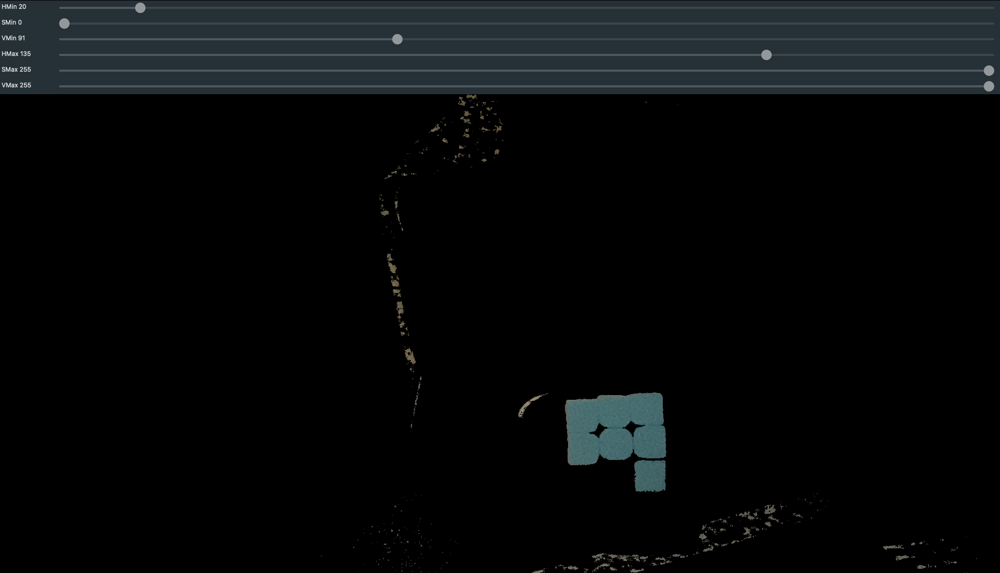
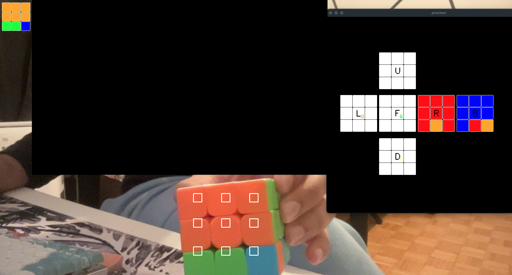
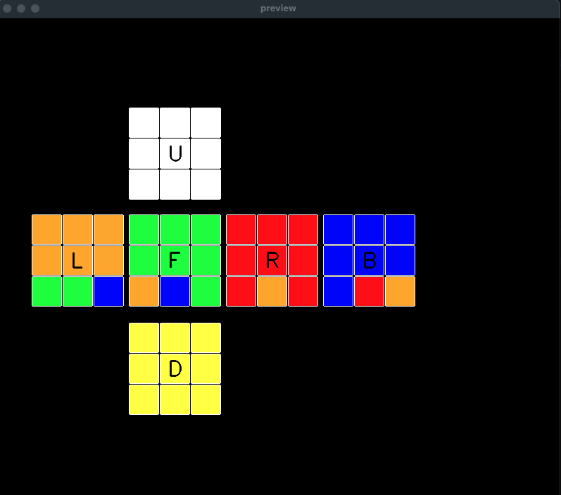
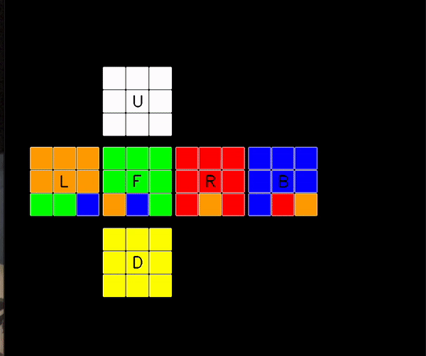
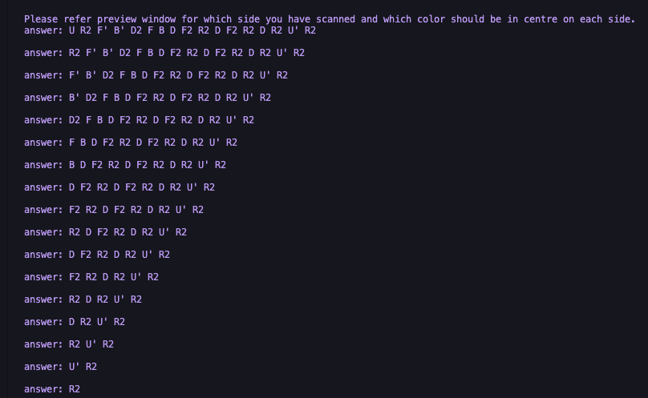

# Rubik's Cube Solver


## Description

The Rubik's Cube Solver is a Python program that aims to solve a scrambled Rubik's Cube using computer vision and the Kociemba algorithm. The program captures a live video feed from a webcam, detects the colors of each sticker, and calculates the optimal moves to solve the cube. The solved cube configuration is then displayed visually and can be printed as text instructions for the user to follow.

## Features

- Real-time Rubik's Cube scanning using a webcam
- Color detection and recognition for each sticker
- Kociemba algorithm for calculating the optimal solution
- Visualization of the solved cube in 2D representation
- Textual instructions for the user to follow
- User-friendly interface for easy interaction

## Installation

1. Clone the repository:
```
git clone https://github.com/mujtabach2/rubixSolver.git
```


3. Install the required Python packages:
```
pip install -r requirements.txt
```

## Setup
1. Before solving, adjust the hsv values in the `detectColor` function in `cube_utils.py`. Due to lighting and different colour cubes, adjustments in hsv are required for optimal detection. It is recommended to detect and solve the cube in consistent lighting and background.

        def detectColor(h,s,v):
            # print(h,s,v)
            if  h >= 84 and v >= 120 and v <= 239 and s >= 169:
                return 'red'
            elif h > 1  and h <= 13 and s >= 122: # good 
                return 'orange'
            elif h <= 37 and h>=13 and s >= 116  and v > 92:
                return 'yellow'
            elif h>=35 and h<= 66 and v >= 131 and s <= 189 and v<= 186:  # good
                return 'green'
            elif h <= 123  and h>=79 : # good 
                return 'blue'
            elif h <= 92 and s<=90 and v<=212:
                return 'white'
    
        return 'white'
2. To aid in setting the hsv run the program:
```
python3 colordetect.py
```

4. Adjust hsv values until the desired colour is the only colour seen on the cube. Remember to adjust values in the function `detectColor` after optimal hsv values are found.


## Usage

1. Run the program:
```
python3 open.py
```

3. Line up the cube on the 9 squares on the screen until the top-left detector matches the face's state, and press the corresponding key on the face of the preview cube to save that face's state.

4. Repeat for all sides being conscious of the position, use the preview for aid.

5. Once all faces are scanned press enter(for each step), and the program will display the solution in 2D visualization and on screen.

6. Textual Instruction will be in the console.



## Acknowledgments

- The [Kociemba](https://github.com/muodov/kociemba) Python library for the Rubik's Cube solving algorithm.
- [OpenCV](https://opencv.org/) for computer vision functionalities.
- [Plotly](https://plotly.com/) for 3D cube visualization.


